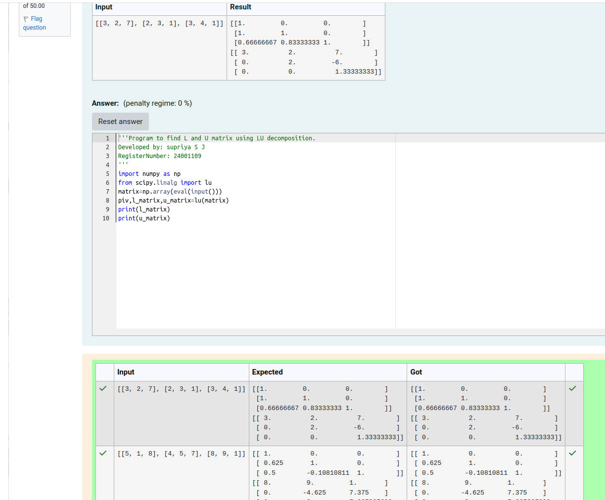

# LU Decomposition 

## AIM:
To write a program to find the LU Decomposition of a matrix.

## Equipments Required:
1. Hardware – PCs
2. Anaconda – Python 3.7 Installation / Moodle-Code Runner

## Algorithm
(i)

1. Import numpy as np and from scipy.linalg import lu
2. Using np.array store matrix in variable matrix
3. Using lu(), we can find the lower triangular matrix and upper triangular matrix
4. print the lower triangular matrix and upper triangular matrix

(ii)


1. Import numpy as np and from scipy.linalg import lu_factor, lu_solve

2.Using np.array store the matrix in variable matrix

3.Using lu_solve(), we can find the LU decomposition of matrix 

4.Using lu_solve(), we can find the solution to linear equation Ax=b where A is matrix,X is unknown vector, b is the right hand-side vector


## Program:
(i) To find the L and U matrix
```

Program to find L and U matrix using LU decomposition.

Developed by: supriya S J

RegisterNumber: 24001109
'''

import numpy as np

from scipy.linalg import lu

matrix=np.array(eval(input()))

piv,l_matrix,u_matrix=lu(matrix)

print(l_matrix)

print(u_matrix)

```
(ii) To find the LU Decomposition of a matrix
```

Program to solve a matrix using LU decomposition.

Developed by: supriya S J

RegisterNumber: 24001109


# To print X matrix (solution to the equations)

import numpy as np

from scipy.linalg import lu_factor,lu_solve

matrix=np.array(eval(input()))

b=np.array(eval(input()))

x=lu_factor(matrix)

sol=lu_solve(x,b)

print(sol)

```

## Output:

.png)

## Result:
Thus the program to find the LU Decomposition of a matrix is written and verified using python programming.

